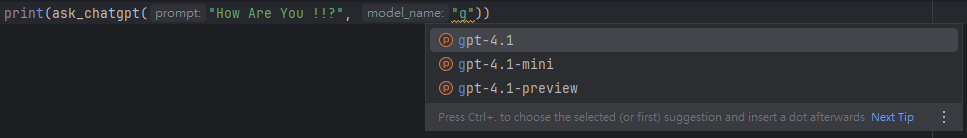

# 使用說明書教學

## 安裝
### 一、我只是使用者
```commandline
pip install ntu-easy-llm.whl
```
### 二、我在一起開發
```commandline
pip install -e ../ntu-easy-llm/.
```

## 代碼範例
### 範例一: 簡單訪問服務
```python
from ntu_easy_llm import ask_chatgpt, ask_gemini

if __name__ == "__main__":
    print(ask_chatgpt("How Are You !!?"))
    print(ask_gemini("How Are You !!?"))
```

### 範例二: 挑選模型


